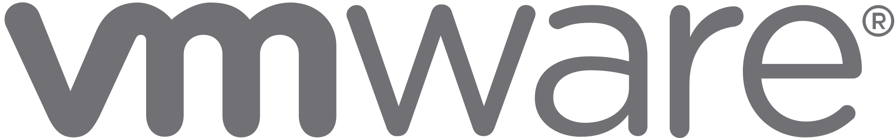

## About me
My name is Alex, and I am an looking to get into the industry as a full stack developer. My story in programming began with a friend of mine introducing me to computer networking at the beginning of 2023 which has led me down one crazy rabbit hole after the next, which has taken my curiosity topics such as virtual machines, self-hosting servers, setting up my own small kubernetes cluster, and eventually has led me to web development. I am passionate about learning the many facets of what allows web technologies to work. I am also facinated by digital electronics and the field of IoT.

I have been learning and honing my skills with Angular and Express.js, creating single page applications with custom APIs.

I am currently employed at Greenbrier Rail Services where I work as a CNC Machinist operating industrial mills and lathes, creating rail car components for the largest names in the rail industy.

## Interests
I have a strong desire to learn more about IoT and learning more about developing for embedded devices.

## Skills
<table>
  <tbody>
    <tr valign="center">
      <td width="20%" align="center">
        
      </td>
      <td width="20%" align="center">
        
      </td>
      <td width="20%" align="center">
        
      </td>
      <td width="20%" align="center">
       
      </td>
    </tr>
    <tr valign="center">
      <td width="20%" align="center">
        
      </td>
      <td width="20%" align="center">
        
      </td>
      <td width="20%" align="center">
        
      </td>
      <td width="20%" align="center">
        
      </td>
    </tr>
    <tr valign="center">
      <td width="20%" align="center">
        
      </td>
      <td width="20%" align="center">
        
      </td>
      <td width="20%" align="center">
        
      </td>
       <td width="20%" align="center">
        
      </td>
    </tr>
  </tbody>
</table>

## Links
[DockerHub](https://hub.docker.com/u/alexmantzdev)  
[Email](alex.mantz@yahoo.com)  
[LinkedIn](https://www.linkedin.com/in/james-mantz-942546138?lipi=urn%3Ali%3Apage%3Ad_flagship3_profile_view_base_contact_details%3BOpTf%2BiY%2BSni7yIQMxo8uaA%3D%3D)

<!--
**AlexMantzDev/AlexMantzDev** is a ✨ _special_ ✨ repository because its `README.md` (this file) appears on your GitHub profile.

Here are some ideas to get you started:

- 🔭 I’m currently working on ...
- 🌱 I’m currently learning ...
- 👯 I’m looking to collaborate on ...
- 🤔 I’m looking for help with ...
- 💬 Ask me about ...
- 📫 How to reach me: ...
- 😄 Pronouns: ...
- ⚡ Fun fact: ...
-->
